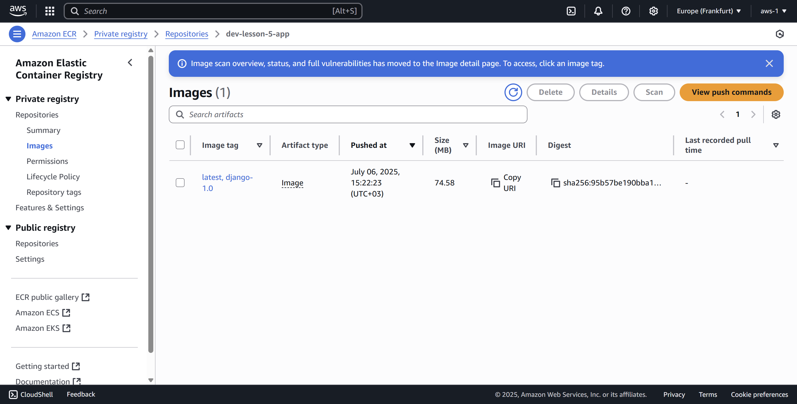
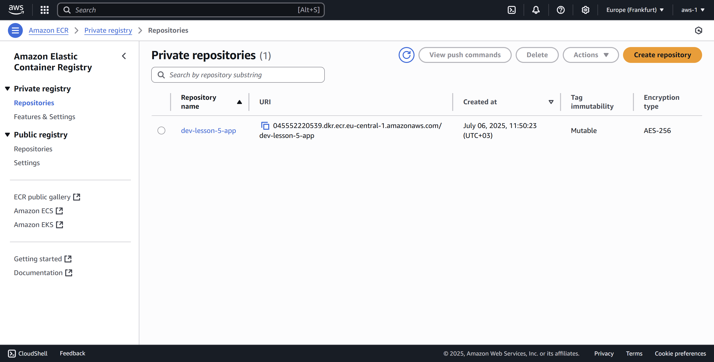
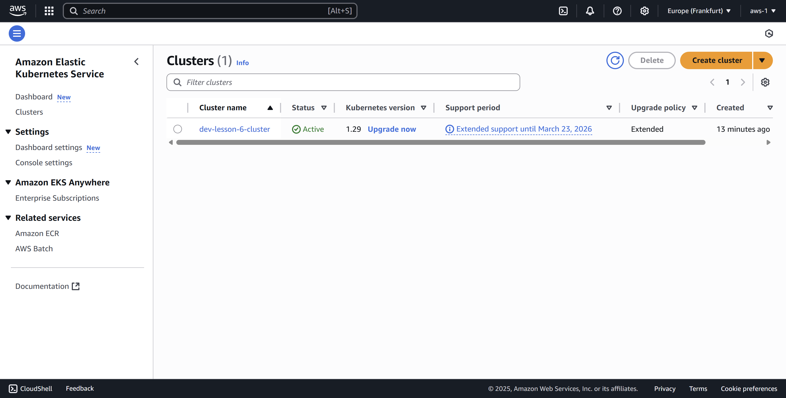
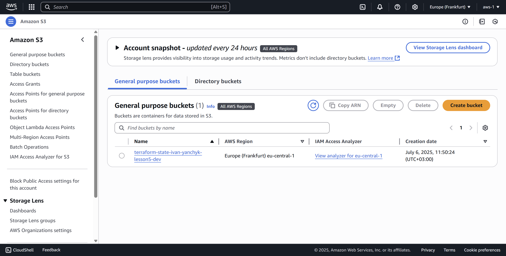
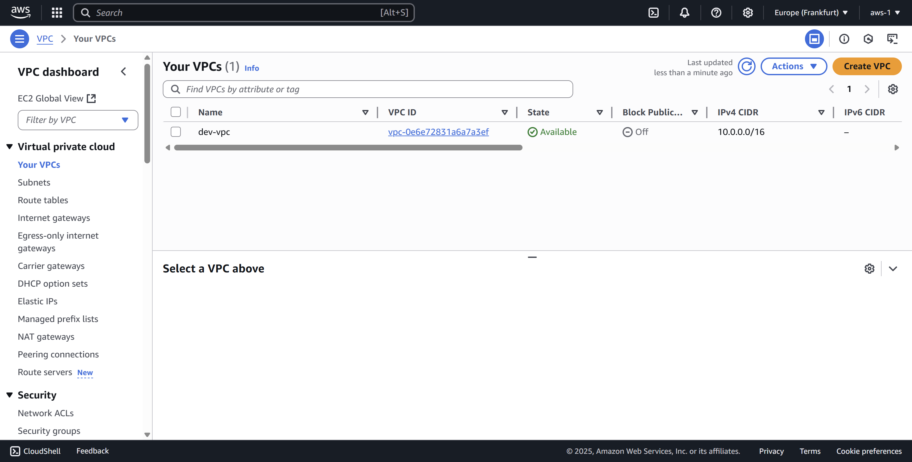
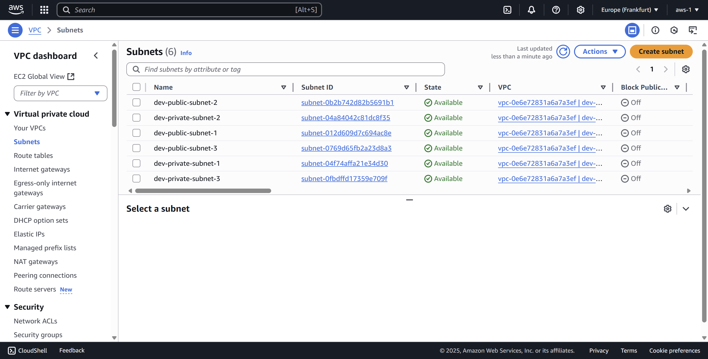
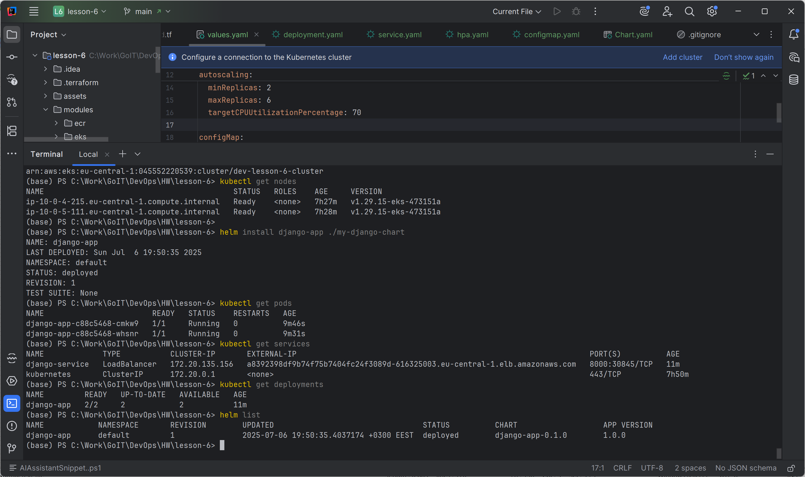
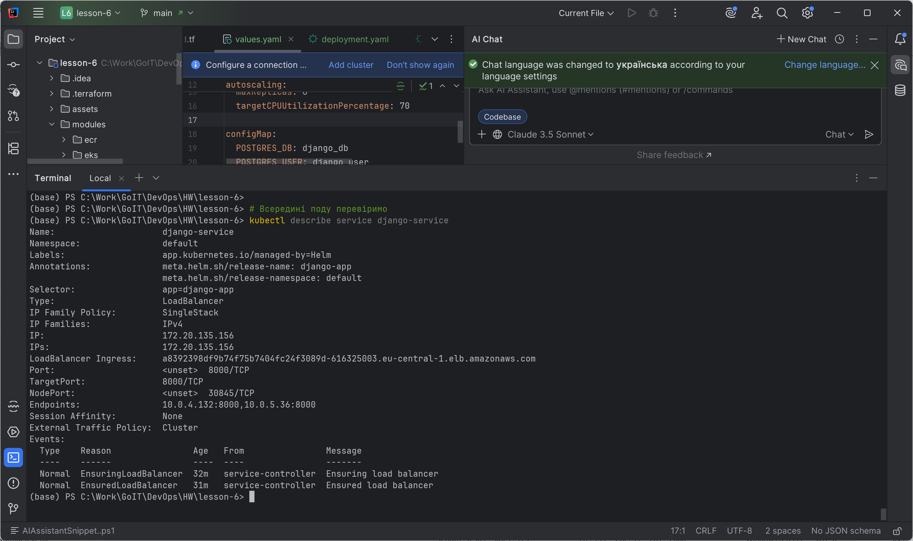

## Завдання до теми «Вивчення Helm»

Ваше завдання — створити кластер Kubernetes у тій самій мережі (VPC), яку ви налаштували в попередньому домашньому завданні, та реалізувати такі компоненти:

1. Створення кластера Kubernetes через Terraform.

2. Налаштування Elastic Container Registry (ECR) для зберігання Docker-образу вашого Django-застосунку.

3. Завантаження Docker-образу Django до ECR.

4. Створення helm chart (deployment.yaml, service.yaml, hpa.yaml, configmap.yaml)

5. Перенесення змінних середовища (env) з теми 4 в ConfigMap, який буде використаний вашим застосунком.


### Кроки виконання завдання

1. Створіть кластер Kubernetes

Використовуючи Terraform, створіть кластер Kubernetes у вже існуючій мережі (VPC).
Забезпечте доступ до кластера за допомогою kubectl.
2. Налаштуйте ECR

Використовуючи Terraform, створіть репозиторій в Amazon Elastic Container Registry (ECR).
Завантажте Docker-образ Django, який ви створювали в темі 4, до ECR, використовуючи AWS CLI.
3. Створіть helm. У Helm-чарті має бути реалізовано:

Deployment — з образом Django з ECR та підключенням ConfigMap (через envFrom).
Service — типу LoadBalancer для зовнішнього доступу.
HPA (Horizontal Pod Autoscaler) — масштабування подів від 2 до 6 при навантаженні > 70%.
ConfigMap — для змінних середовища (перенесених із теми 4).
values.yaml — з параметрами образу, сервісу, конфігурації та autoscaler.


### Структура проєкту

```
lesson-7/
│
├── main.tf                  # Головний файл для підключення модулів
├── backend.tf               # Налаштування бекенду для стейтів (S3 + DynamoDB
├── outputs.tf               # Загальні виводи ресурсів
│
├── modules/                 # Каталог з усіма модулями
│   ├── s3-backend/          # Модуль для S3 та DynamoDB
│   │   ├── s3.tf            # Створення S3-бакета
│   │   ├── dynamodb.tf      # Створення DynamoDB
│   │   ├── variables.tf     # Змінні для S3
│   │   └── outputs.tf       # Виведення інформації про S3 та DynamoDB
│   │
│   ├── vpc/                 # Модуль для VPC
│   │   ├── vpc.tf           # Створення VPC, підмереж, Internet Gateway
│   │   ├── routes.tf        # Налаштування маршрутизації
│   │   ├── variables.tf     # Змінні для VPC
│   │   └── outputs.tf  
│   ├── ecr/                 # Модуль для ECR
│   │   ├── ecr.tf           # Створення ECR репозиторію
│   │   ├── variables.tf     # Змінні для ECR
│   │   └── outputs.tf       # Виведення URL репозиторію
│   │
│   ├── eks/                 # Модуль для Kubernetes кластера
│   │   ├── eks.tf           # Створення кластера
│   │   ├── variables.tf     # Змінні для EKS
│   │   └── outputs.tf       # Виведення інформації про кластер
│
├── charts/
│   └── django-app/
│       ├── templates/
│       │   ├── deployment.yaml
│       │   ├── service.yaml
│       │   ├── configmap.yaml
│       │   └── hpa.yaml
│       ├── Chart.yaml
│       └── values.yaml     # ConfigMap зі змінними середовища
```
### Результати виконання
- У вашому AWS-акаунті створено кластер Kubernetes.
- ECR містить завантажений Docker-образ Django-застосунку.
- Застосунок розгорнутий у кластері за допомогою Helm-чарта.
- Service забезпечує доступ до застосунку через публічну IP-адресу.
- ConfigMap підключено до застосунку через Helm.
- HPA динамічно масштабує кількість подів.
- (Бонус) Якщо є домен, налаштовано Ingress із TLS через cert-manager.

## Результати
### Django docker image

### ECR

### EKS

### S3

### VPC

### Subnets

### Cluster info

### Service description
