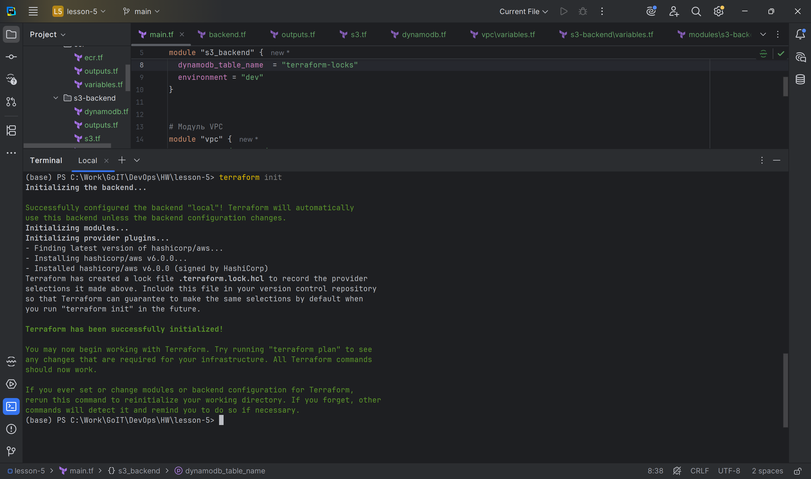
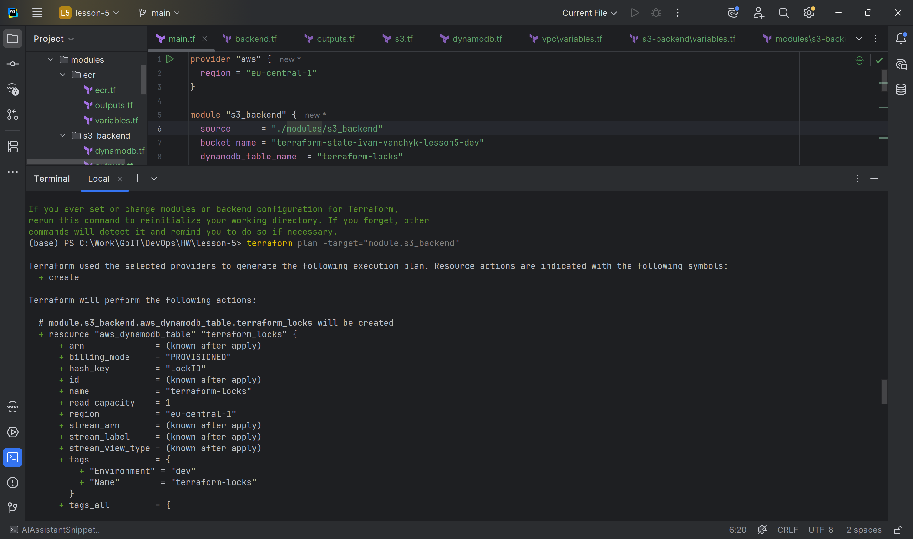
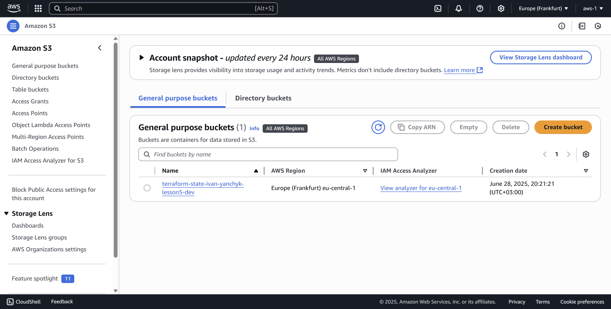
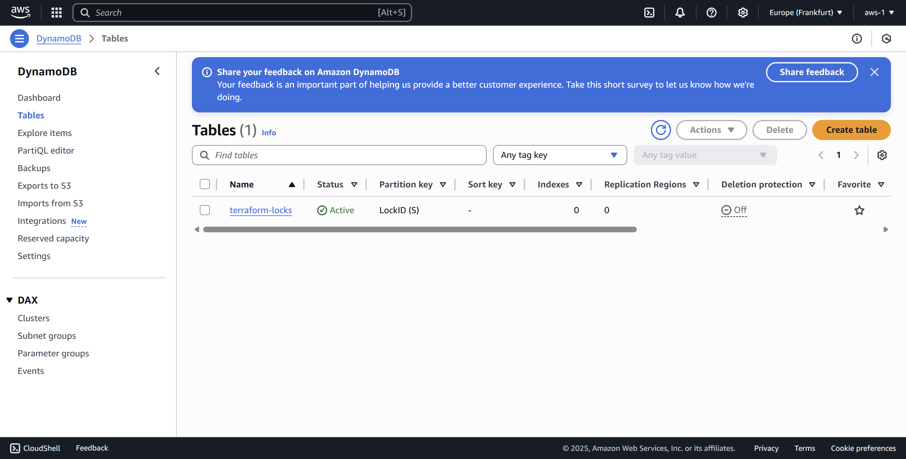
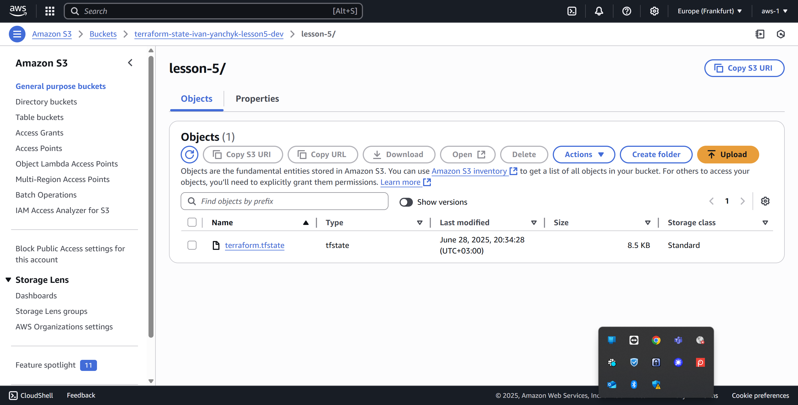

## Створення Terraform-структури для інфраструктури на AWS у новій директорії lesson-5.

Вам потрібно налаштувати:

1. Синхронізацію стейт-файлів у S3 з використанням DynamoDB для блокування.

2. Мережеву інфраструктуру (VPC) з публічними та приватними підмережами.

3. ECR (Elastic Container Registry) для зберігання Docker-образів.


### Структура проєкту
```js
lesson-5/
│
├── main.tf                  # Головний файл для підключення модулів
├── backend.tf               # Налаштування бекенду для стейтів (S3 + DynamoDB)
├── outputs.tf               # Загальне виведення ресурсів
│
├── modules/                 # Каталог з усіма модулями
│   │
│   ├── s3-backend/          # Модуль для S3 та DynamoDB
│   │   ├── s3.tf            # Створення S3-бакета
│   │   ├── dynamodb.tf      # Створення DynamoDB
│   │   ├── variables.tf     # Змінні для S3
│   │   └── outputs.tf       # Виведення інформації про S3 та DynamoDB
│   │
│   ├── vpc/                 # Модуль для VPC
│   │   ├── vpc.tf           # Створення VPC, підмереж, Internet Gateway
│   │   ├── routes.tf        # Налаштування маршрутизації
│   │   ├── variables.tf     # Змінні для VPC
│   │   └── outputs.tf       # Виведення інформації про VPC
│   │
│   └── ecr/                 # Модуль для ECR
│       ├── ecr.tf           # Створення ECR репозиторію
│       ├── variables.tf     # Змінні для ECR
│       └── outputs.tf       # Виведення URL репозиторію ECR
│
└── README.md                # Документація проєкту

```

## Кроки виконання завдання

1. Створіть основну структуру проєкту

У кореневій папці lesson-5 створіть файли:

main.tf — підключення модулів.
backend.tf — налаштування бекенду для збереження стейтів у S3.
outputs.tf — загальні вихідні дані з усіх модулів.


2. Налаштуйте S3 для стейтів і DynamoDB

У модулі s3-backend:

Налаштуйте S3-бакет для стейт-файлів Terraform.
Увімкніть версіювання для збереження історії стейтів.
Налаштуйте таблицю DynamoDB для блокування стейтів.
Виведення має відбуватись у outputs.tf URL S3-бакета та ім'я DynamoDB.


3. Побудуйте мережеву інфраструктуру (VPC)

У модулі vpc:

Створіть VPC з CIDR блоком.
Додайте 3 публічні підмережі та 3 приватні підмережі.
Створіть Internet Gateway для публічних підмереж.
Створіть NAT Gateway для приватних підмереж.
Налаштуйте маршрутизацію через Route Tables.


4. Створіть репозиторій ECR

У модулі ecr:

Створіть ECR-репозиторій з автоматичним скануванням образів.
Налаштуйте політику доступу для репозиторію.
Виведіть URL репозиторію через outputs.tf.


5. Підключіть усі модулі в main.tf
```js
# Підключаємо модуль S3 та DynamoDB
module "s3_backend" {
   source      = "./modules/s3-backend"
   bucket_name = "ваше ім'я"
   table_name  = "terraform-locks"
}

# Підключаємо модуль VPC
module "vpc" {
   source             = "./modules/vpc"
   vpc_cidr_block     = "10.0.0.0/16"
   public_subnets     = ["10.0.1.0/24", "10.0.2.0/24", "10.0.3.0/24"]
   private_subnets    = ["10.0.4.0/24", "10.0.5.0/24", "10.0.6.0/24"]
   availability_zones = ["us-west-2a", "us-west-2b", "us-west-2c"]
   vpc_name           = "lesson-5-vpc"
}

# Підключаємо модуль ECR
module "ecr" {
   source      = "./modules/ecr"
   ecr_name    = "lesson-5-ecr"
   scan_on_push = true
}

```

6. Налаштуйте бекенд для Terraform

Створіть backend.tf для налаштування S3 як бекенду:
```js
terraform {
   backend "s3" {
      bucket         = "ваше ім'я"
      key            = "lesson-5/terraform.tfstate"
      region         = "us-west-2"
      dynamodb_table = "terraform-locks"
      encrypt        = true
   }
}

```

7.Команди для ініціалізації та запуску:
```js
terraform init
terraform plan
terraform apply
terraform destroy
````


# Terraform AWS Infrastructure

## Опис проекту
Цей проект містить Terraform конфігурацію для розгортання базової AWS інфраструктури, що включає:
- S3 бакет та DynamoDB для зберігання та блокування Terraform стейту
- VPC з публічними та приватними підмережами
- ECR репозиторій для Docker образів


## Передумови
- AWS CLI встановлений та налаштований
- Terraform версії >= 1.0.0
- Створений IAM usr з правами доступу до AWS: AmazonS3FullAccess, AmazonDynamoDBFullAccess
- В локальну конфігурацію AWS додано Access Key та Secret Access Key створеного користувача

0. створити IAM користувача
   додати локально в конфігурацію AWS Access Key та Secret Access Key створеного користувача
   aws configure
1. мінімальні дозволи, які потрібно надати IAM користувчу:
   AmazonS3FullAccess
   AmazonDynamoDBFullAccess

2. створюємо файл ресурсів terraform.tfstate локально (з'явиться в проекті)
   // backend.tf
   terraform {
   backend "local" {}
   }

3. в консолі:
   terraform init
   terraform plan -target="module.s3_backend"
   terraform apply -target="module.s3_backend"

4. перевірка створених ресурсів
   // в консолі
   aws s3 ls
   aws dynamodb list-tables --region eu-central-1
   // на ASW
   в полі пошуку ввести:
   S3
   DynamoDB

5. переносимо конфігураційний файл terraform.tfstate в створений на AWS бакет:
   5.1 // в backend.tf змінюємо конфігурацію:
   terraform {
   required_providers {
   aws = {
   source  = "hashicorp/aws"
   version = "~> 6.0"
   }
   }

   backend "s3" {
   bucket         = "terraform-state-ivan-yanchyk-lesson5-dev"
   key            = "lesson-5/terraform.tfstate"
   region         = "eu-central-1"
   dynamodb_table = "terraform-locks"
   encrypt        = true
   }
   }
   5.2 // terraform init -reconfigure

6. перевіряємо наявність конфігураційного файлу на AWS бакеті:
   aws s3 ls s3://terraform-state-ivan-yanchyk-lesson5-dev

7. видалення створених ресурсів:
    1. видаляємо вміст бакета:
       aws s3 rm s3://terraform-state-ivan-yanchyk-lesson5-dev --recursive
    2. видалення ресурів:
       terraform destroy
       або
       terraform destroy -lock=false

## Результати




